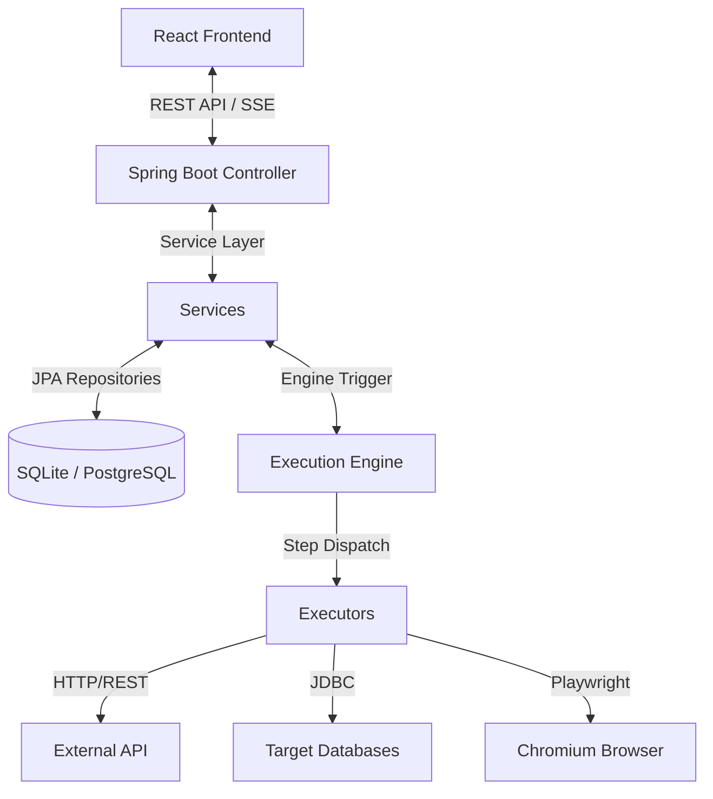

# Orion Project Understanding Document

This document provides a comprehensive technical, functional, and design breakdown of the **Orion Visual Test Execution & Orchestration Platform**. It serves as a unified reference point for System Architects, Software Developers, UI/UX Designers, and Business Analysts.

---

## 1. Functional & Business Overview
*Perspective: Expert Business Requirement Analyst*

Orion is an enterprise-grade visual test automation suite designed to bridge the gap between low-code/no-code visual designers and robust programmatic test execution. 

### Key Business Capabilities:
*   **Visual Test Designer:** Allows QA and non-technical stakeholders to build automated validation tests without writing code.
*   **Multi-Protocol Ingestion:** Supports REST APIs, SOAP services, JDBC Database queries, and Playwright-based browser automations in a single workflow.
*   **Dynamic Variable Scoping:** Supports running workflows dynamically against separate environments (e.g., Development, Staging, Production) utilizing a variable drawer.
*   **mTLS Support:** Essential for financial, healthcare, and enterprise integrations requiring mutual TLS client certificates.
*   **Self-Healing Setup:** Automatically seeds database schemas, user roles, and default credentials upon initialization to reduce setup friction.
*   **Chrome Recording Extension:** Captures browser interactions via a web proxy recording controller and automatically builds test steps from browser events.

---

## 2. Technical Architecture & Data Flows
*Perspective: System Design Architect*

The project is structured as a monorepo containing a Spring Boot 3.3 backend and a React 18 + Vite frontend.



### Core Architecture Components:
1.  **Frontend Clients:** Built using React, Zustand (state management), and TanStack Query (server state synchronization). Uses Tailwind CSS for a premium dark-themed interface.
2.  **Backend Server:** Core engine built using Java 21+ and Spring Boot. Employs Spring Security (JJWT) for role-based authorization (`ADMIN`, `TESTER`, `VIEWER`).
3.  **Step Execution Engine:** Dispatches actions asynchronously (`@Async`) to a dedicated task executor, executing steps sequentially. Parallel groupings run concurrently utilizing Java virtual threads.
4.  **Database Layer:** Managed via Hibernate/JPA, with schema generation enforced via Flyway migration scripts (`db/migration/`).

---

## 3. Database Schema Layout
*Perspective: System Design Architect / Backend Developer*

Orion uses a relational schema. Below are the key tables defined in Flyway migrations:

*   **`users`**: Manages credentials, roles (`ADMIN`, `TESTER`, `VIEWER`), and activation status.
*   **`applications`**: Groups workflows under projects/applications.
*   **`environments`**: Configures specific environments mapped to applications.
*   **`environment_variables`, `environment_databases`, `environment_certificates`**: Stores environment-scoped key-value pairs, JDBC connection metadata, and mTLS certificates.
*   **`test_cases` & `test_steps`**: Defines execution logic. Test steps store their payload configurations inside a raw JSON string column (`config`).
*   **`executions` & `execution_step_logs`**: Captures execution statistics (duration, pass rates, errors) and individual step status logs (running, passed, failed, skipped) along with detailed input/output JSON payloads.
*   **`global_test_steps`**: Admin-managed reusable templates for standard routines (e.g., auth routines).
*   **`audit_logs`**: Tracks action logs for governance and security compliance.

---

## 4. Backend Step Execution Engine
*Perspective: Software Developer*

The execution engine uses the **Strategy Pattern** to dynamically run steps.

### Step Executor Structure
All executors implement the `StepExecutor` interface:
```java
public interface StepExecutor {
    StepResult execute(TestStep step, Map<String, Object> config, Map<String, String> context);
    Set<TestStep.StepType> supportedTypes();
}
```

*   **`HttpRequestExecutor`:** Executes RESTful API calls. Handles headers, JSON payloads, and retrieves responses.
*   **`SoapRequestExecutor`:** Processes XML payload requests wrapping them with SOAP 1.1/1.2 envelopes.
*   **`DatabaseQueryExecutor`:** Executes SQL statements using dynamic JDBC connections.
*   **`BrowserAutomationExecutor`:** Spins up headless Chromium instances via **Playwright** to execute actions: `navigate`, `fill`, `click`, `waitForElement`, and `screenshot`.
*   **`AssertionExecutor`:** Extracts values from body payloads (JSONPath/XPath) or headers and compares them against assertions.
*   **`SetVariableExecutor`:** Extracts dynamic values from parent step payloads and caches them in the execution context for downstream interpolation.
*   **`LogExecutor`, `DelayExecutor`:** Custom logging and delays.
*   **`LoopExecutor` & `ConditionalExecutor`:** Control-flow engine components (currently implemented as stubs/placeholders).

---

## 5. Frontend Components & Design System
*Perspective: UI/UX Designer*

The UI is built on a dark-theme aesthetic using custom-designed cards, drawers, and tabs.

### Key UX Subsystems:
1.  **Sidebar Config Drawer (`StepConfigPanel.tsx`):**
    *   Slides out to display the settings of the selected test step.
    *   Features a custom drag-to-resize boundary.
    *   Includes dedicated sub-config forms tailored to each step type (e.g., SOAP envelope textareas, database credential inputs, browser action steps).
2.  **Step Type Selector (`StepTypeSelector.tsx`):**
    *   Renders a grid categorizing actions into Primary, Support, Display, and Technical options.
    *   Applies distinct color-coded badges and icons (e.g., cyan for HTTP, teal for browser, green for assertions).
3.  **Real-Time Logs Canvas (`ExecutionDetailPage.tsx`):**
    *   Consumes a Server-Sent Events (SSE) stream (`/api/executions/{execId}/stream`) to display step execution logs in real-time.
    *   Renders dynamic collapsible sections for input payloads, output responses, and Playwright screenshots.
